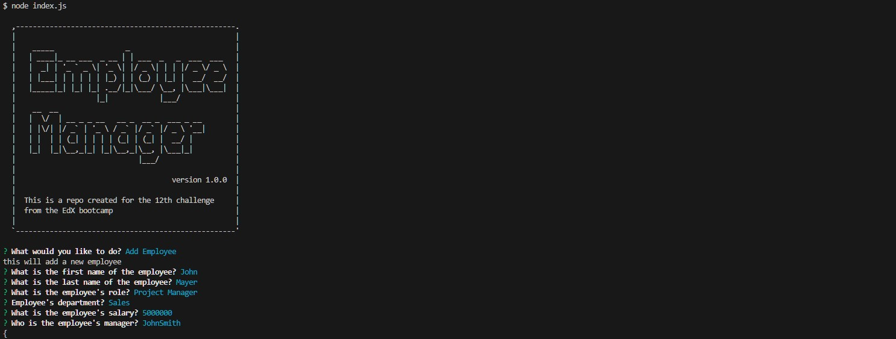

# 12-Employee-Tracker-CLI
This is a repo created for the 12th challenge from the EdX bootcamp and Tec de Monterrey

## Description

This project is a CLI application that uses an SQL database, Javascript and Node to manage a Company Employee list. With this application, the user can view in the terminal a series of questions (via inquirer) so that he can view the employees, departments, add employees, salaries, etc.

## Table of contents

- [Installation](#installation)
- [Mockup](#mockup)
- [Video](#video)
- [Credits](#credits)
- [License](#license)
- [Contributing](#contributing)
- [Tests](#tests)
- [Questions](#questions)

## Installation
Please use NPM i to install the dependencies.

## Mockup
The application should look like this

## Video
Follow this link to a video walktrough https://drive.google.com/file/d/1rMGL38xRcqPSx-uzhK4jFeuDE8oweAQS/view?usp=drive_link

## Credits
This CLI application acceptance criteria was provided by EdX bootcamps & Tec de Monterrey. The functionality was coded by me with support from a tutor.

## License
This project is licensed under the MIT license.

## Contributing
This repo is not open for contributions.

## Tests
N/A

## Questions
If you have any questions about the repo, open an issue or contact me directly at testemail@hotmail.com. You can find more of my work at [AlexTrejo92](https://github.com/AlexTrejo92).